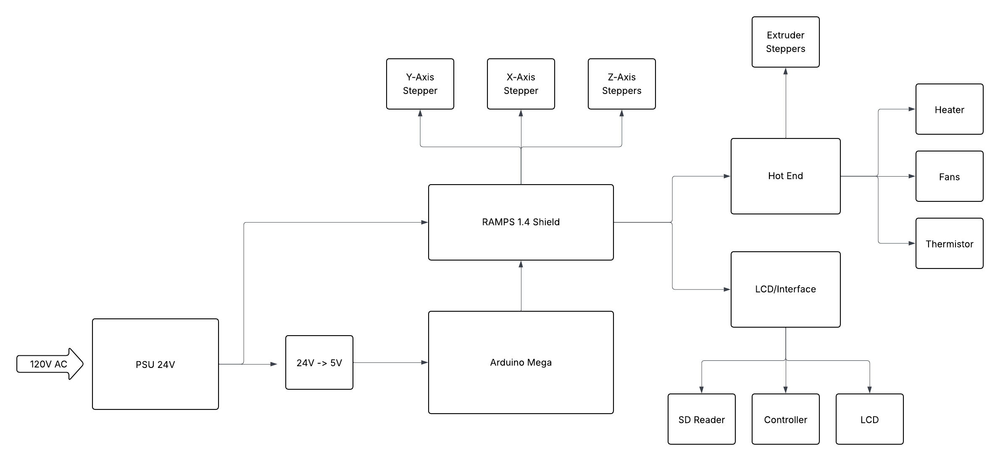

# PRINT ALL THE THINGS!

## Overview

A Cartesian, Bed-slinger style, printer. Y motion is applied to the print plate while the hot-end moves in the X and Z directions. This design was selected to give a simple starting point to begin 3d printing. At this point the printer is still a prototype though it does now complete prints reliably. I am working to make incremental improvements to the design over time. More details about my longterm plans can be found in the roadmap below.

- AnyCubic Kobra 2 Direct Drive Extruder Assembly
- Print Area:  290 x 180 x 300 mm (Y will be 250-290 after redesign) 
- Total Size:  480 x 540 x 540 mm
- Arduino Mega - Marlin Firmware
- Reprap 1.4 Control Board
- Orange Pi 4 LTS (Octoprint server)

## Roadmap

The following milestones will be used to direct my efforts in this project. My overall philosophy here has been to begin with the simplest and lowest cost printer possible, regardless of its print speed and quality. Now that the basic device is built I have begun iterating on it to improve its function and reliability.

### MK0 - Zip Ties and Prayers ---- Done!

- Goal: Print a cube
- Status: Complete
- Expected Date: 06/30/2025 
- Completion Date: 07/14/2025
- Comments:  This is meant to be a minimum viable product. The only expectation is that I can connect to it, upload g-code and the printer will make a recognizable attempt to print it. At this time I will not be concerned with the print speed or any issues with the output (within reason). It is also notable that for this step I will not have access to 3d printed parts so many of the brackets and connections will need to be made with a combination of particle board, zip ties and assorted hardware.  
 - [Debrief](https://github.com/SamBaker101/PATT_MK0/blob/main/docs/MK0/MK0_debrief.md)  
 - [Testing](https://github.com/SamBaker101/PATT_MK0/blob/main/docs/MK0/MK0_testing.md)  
 - [BOM](https://github.com/SamBaker101/PATT_MK0/blob/main/docs/MK0/MK0_BOM.csv)     

### MK1 - It Prints Itself?

- Goals: 
     - Replace all temporary parts with self printed parts, these parts must be reliable, consistant and free of major artifacts. 
     - Reorganize electronics onto a board or container integrated into the printer body.
     - Add capability to print remotly over wifi.   
- Status: In Progress
- Expected Date: -
- Comments: Once MK0 is able to complete prints I will begin replacing the temporary plywood parts with custom designed 3d printed parts. I expect this to be an iterative process as replacing selected parts should increase the overall print quality which would in turn allow me to make better versions of those parts. At this time I will also be adding mechanical belt tensioning systems and a reliable bed leveling mechanism. I will also create an electronics board beneath the print bed and clean up the wire routing. Having my laptop wired to print is a major pain point so I will also be adding an OctoPrint server to manage prints.
 - [Debrief](https://github.com/SamBaker101/PATT_MK0/blob/main/docs/MK1/MK1_debrief.md)  
 - [BOM](https://github.com/SamBaker101/PATT_MK0/blob/main/docs/MK1/MK1_BOM.csv)     

## MK2 - Use It

- Goal: 
     - Print a Benchy in under 45min with no major quality issues
- Status: Planned
- Expected Date: Open
- Comments: I think it's important here to use the printer for it's intended purpose for few weeks-months building other projects. I am eager to begin work on some new robotics projetcs and to explore the organizational print community so this shouldn't be a struggle. This will give me a better sense of the printers capabilities and it's pain points.  As I become more familiar with the printer I will iterate on the custom parts and look at other enhancements that can be made to improve performance. 

### MK3 - Upgrade$$$

- Goal: 
     - Print Benchy without major errors in PETG, TPE and ABS. 
     - Print in place chainmail in PLA.
     - Print Benchy in PLA in less than 30 min
- Status: Planned
- Expected Date: Start date + 2 months
- Comments: In my initial build I generally went with the lowest cost option to avoid any expensive mistakes, Now is the time to correct that. Upgrade the control board, motor controllers and hot end to competitive versions. At this time I will also add a heated bed and upgrade any of the PLA printed parts as required. By now I can expect to be well aware of any other issues in the build (linear rods, lead screws ect), so I will take care of any of these issues which I've been putting off.

#### MKZ - Next Steps
- Explore alternate configurations (Core XY, Delta 3d ect.)
- Build a vented, temperature controlled (and sound insulating) cabinet
- Add a second extruder
- Build an AMS
- Build a dry box

## Electrical

| Part               | Part Detail   | Number | Voltage      |Current       | Power          | Comment                             |
|--------------------|---------------|--------|--------------|--------------|----------------|-------------------------------------|
|Stepper             |Nema 17        | 5      |  24V         |1.7A          | 40.8W          |                                     |
|Motor Controllers   |TMC2209        | 4      |  24V         |7.5mA         | 180mW          | Z-Axis can share controller, RAMPS board may need modification to use these  |
|Hot End             |Anycubic Kobra2| 1      |24/5V|| 60W            | This is temporary but will get me up and running, Power number is a rough estimate as hard numbers are limited  |
|Driver Board        |RAMPS1.4       | 1      |  24V         ||                | Interested in designing my own in future, Needed slight modification to run at 24V|
|Main Board          |Arduino Mega   | 1      |  5V          ||                | Draw 5V off RAMPS board, cut power diode on RAMPS to avoid running 24V in|   
|Limit Switches      |Leaf Switches  | 3      |              ||                |                                     |
|Heated Bed          |?              | 1      |              ||                | Will leave off initial build and upgrade later |
|PSU                 |LEDMO          | 1      | 24V          | 20A | 480W               | https://www.amazon.ca/gp/product/B08975B78Z/ref=ox_sc_act_title_4?smid=A38O99J0OT8HQ0&th=1  |
|Fans                |               | 1+     | 12-24V       ||                |                                     |  
|OctoPrint Server    |Orange Pi 4 LTS| 1      | 5V           ||                | Has been a bit unreliable so I may switch to an RPi Zero 2W|

### Electronics Box

As part of the MK1 improvements to my original prototype I am currently designing a small sidecar for the printer which will house the Arduino Mega (With RAMPS board), The Orange Pi (Being used for Octoprint) and the Reprap Display Board. 

In order to simplify the wiring I will be organizing the outputs on the back of this box into two D-Sub 25 pin connectors. One of these connectors will have the 18 pin connections for the hotend as well as the 4 pins used to drive the extruder motor. The other contain the other 16 motor connections and the 9 endstop wires. I will mismatch these connectors (Male for the printhead and female for the motors) to avoid the possibility of them being plugged in backwards.

The wiring and pincount of these connectors could probably be simplified in future by combining grounds and voltage lines but I will leave that as a future refinement at this time.

The box will also have power inputs for the Orange Pi (USB-C) and the RAMPs board (24V from PSU).

## Modelling

NOTE: These models are approximate versions created while developing the printer design. I am in the process of redesigning a number of the parts and will be updating these assemblies as I solidify their new models.

The model is broken into 3 primary sections, one for each axis. The Y-axis assembly includes the print plate while the X-axis includes the hotend and extruder. Each of these main assemblies is further divided into sub assemblies to isolate different segments such as motor drives, frame segments, ect. 

All models were created using FreeCAD 1.0. FreeCAD can be downloaded at the following link.

https://www.freecad.org/

### Models

#### Full Frame

#### Y-Axis

#### X-Axis

#### Z-Axis

## Parts

My initial approach to part selection was to minimize cost wherever reasonable. My goal was to build a functional printer without a strong focus on print speed or quality. This was to allow time to develop my own skills and identify any knowledge gaps or incorrect assumptions I have.  

Now that I have created a prototype device, I will begin iterating on the device and replacing those lower cost parts with higher end equipment to improve overall quality.

[MK0 BOM](https://github.com/SamBaker101/PATT_MK0/blob/main/docs/MK0/MK0_BOM.csv)

### Custom Parts

Now that MK0 is complete I am beginning the process of replacing the wood panel parts with 3d printed ones. Additionally there are a number of fairly hackey fixes (tensioners, bed leveling, endstops ect) which need more robust solutions.

As I design these new parts I will place the stl files [here](https://github.com/SamBaker101/PATT_MK0/tree/main/models/custom_parts).

Additionally I will include pictures and short descriptions of each part in this [document](https://github.com/SamBaker101/PATT_MK0/blob/main/models/custom_parts/custom_parts.md).

As I get into replacing the more structural components of the build I will also replace the draft assemblies with new more accurate ones.

