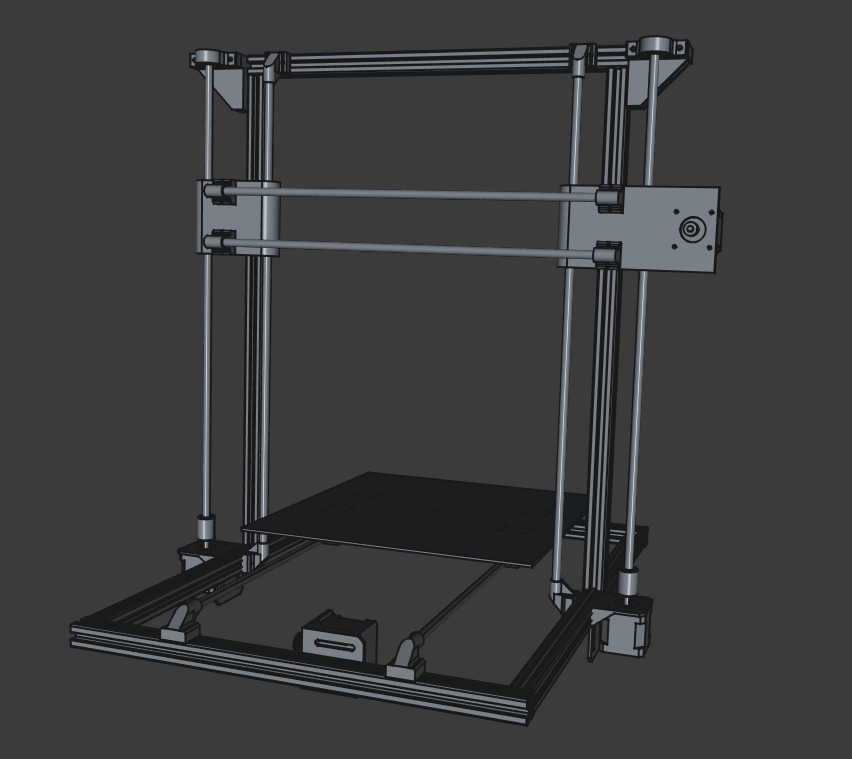
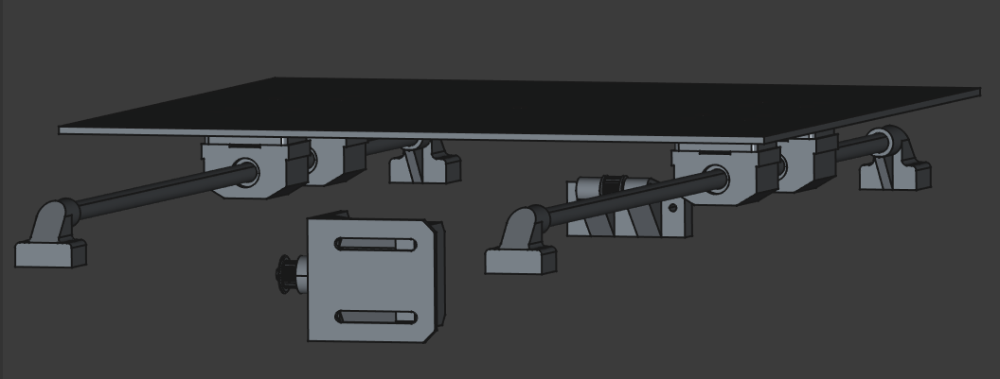
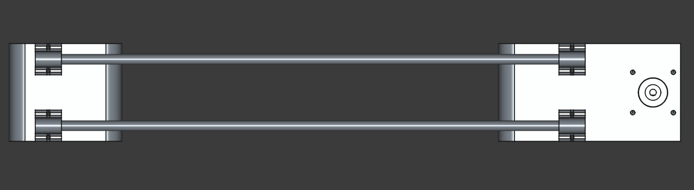
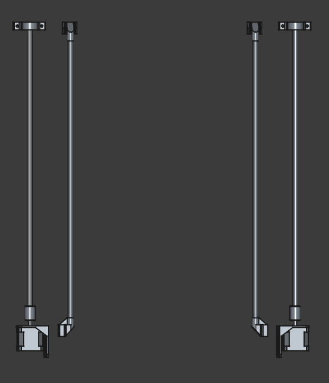
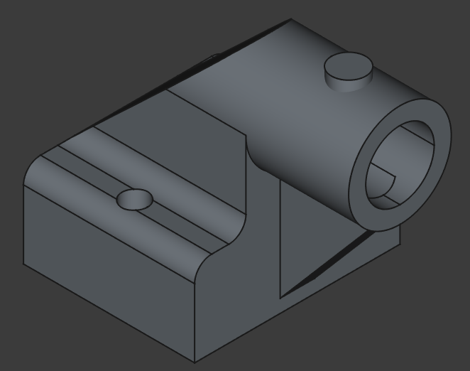
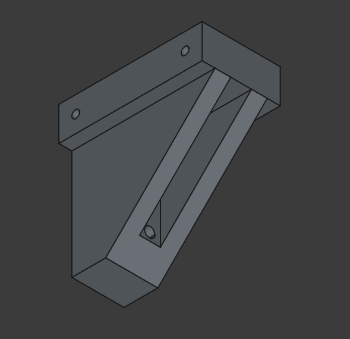

# PRINT ALL THE THINGS!

## A Quick Note

This project is still in the design phase and as yet remains unproven. 

## Design Considerations

My intention is to build a basic Cartesian printer. Y motion will be applied to the print plate while the hot-end will move in the X and Z directions. It's my feeling that this will provide the most straightforward framework to develop a working printer which I can iterate and improve upon over time.

- Print Area: ~300 x 300 x 300 mm 
- Total Size:  480 x 540 x 540 mm
- Frame Material: 2020 Aluminium Extrusion (T-Slot)

- 8mm Linear Rods and Bearings 
     - 2 per axis

- Actuation:
     - X and Y Axis: 6mm Belt
     - Z-Axis: Dual Lead Screws

## Roadmap

The following milestones will be used to direct my efforts in this project. My overall philosophy here is to begin with the simplest and lowest cost printer I can create regardless of its print speed and quality. Once this basic device is built I will begin iterating on it to improve its function and reliability.

### MK0 - Zip Ties and Prayers

- Goal: Print a cube
- Status: In Progress
- Expected Date: 06/30/2025 
- Comments:  This is meant to be a minimum viable product. The only expectation is that I can connect to it, upload g-code and the printer will make a recognizable attempt to print it. At this time I will not be concerned with the print speed or any issues with the output (within reason). It is also notable that for this step I will not have access to 3d printed parts so many of the brackets and connections will need to be made with a combination of particle board, zip ties and assorted hardware.

### MK1 - It Prints Itself?

- Goal: Replace all temporary parts with self printed parts, these parts must be reliable, consistant and free of major artifacts.
- Status: Planned
- Expected Date: 08/30/2025
- Comments: Once MK0 is able to complete prints I will begin replacing the temporary plywood parts with custom designed 3d printed parts. I expect this to be an iterative process as replacing selected parts should increase the overall print quality which would in turn allow me to make better versions of those parts. At this time I will also be adding mechanical belt tensioning systems and a reliable bed leveling mechanism.

### MK2 - Upgrade$$$

- Goal: Print Benchy without major errors in PETG, TPE and HIPS. Print in place an extendable sword in PLA.
- Status: Planned
- Expected Date: 10/30/2025
- Comments: In my initial build I generally went with the lowest cost option to avoid any expensive mistakes, Now is the time to correct that. Upgrade the control board, motor controllers and hot end to competitive versions. At this time I will also add a heated bed and upgrade any of the PLA printed parts as required. At this point I expect to be well aware of any other issues in the build (linear rods, lead screws ect), so I will take care of any of these issues which I've been putting off.

#### MKZ - Next Steps
- Explore alternate configurations (Core XY, Delta 3d ect.)
- Build a temperature controlled (and sound insulating) cabinet
- Add a second extruder

## Electrical

| Part               | Part Detail   | Number | Voltage      |Current       | Power          | Comment                             |
|--------------------|---------------|--------|--------------|--------------|----------------|-------------------------------------|
|Stepper             |Nema 17        | 5      |  24V         |1.7A          | 40.8W          |                                     |
|Motor Controllers   |TMC2209        | 4      |  24V         |7.5mA         | 180mW          | Z-Axis can share controller, RAMPS board may need modification to use these  |
|Hot End             |Anycubic Kobra2| 1      ||| 60W            | This is probably very temporary but will get me up and running, Power number is a rough estimate as hard numbers are limited  |
|Driver Board        |RAMPS1.4       | 1      |  24V         ||                | Interested in designing my own in future, will need modification to run at 24V|
|Main Board          |Arduino Mega   | 1      |  5V          ||                | Draw 5V off RAMPS board, cut power diode on RAMPS to avoid running 24V in|   
|Limit Switches      |Leaf Switches  | 3      |              ||                |                                     |
|Heated Bed          |?              | 1      |              ||                | Will leave off initial build and upgrade later |
|PSU                 |LEDMO          | 1      | 24V          | 20A | 480W               | https://www.amazon.ca/gp/product/B08975B78Z/ref=ox_sc_act_title_4?smid=A38O99J0OT8HQ0&th=1  |
|Fans                |               | 1+     | 12-24V       ||                |                                     |  

## Modelling

The model will be broken into 3 primary sections, one for each axis. The Y-axis assembly will include the print plate while the X-axis will include the hotend and extruder. Each of these main assemblies will be further divided into sub assemblies to isolate different segments such as motor drives, frame segments, ect. 

All models will be created using FreeCAD 1.0. FreeCAD can be downloaded at the following link to access or modify the files:

https://www.freecad.org/

### Models

#### Full Frame

Needs Feet of some kind as the motors will drop beneath the frame by ~20mm. Could assist with leveling and shock absorbtion as well.

#### Y-Axis

#### X-Axis

 - Cart and hot end assembly still required
 - XZ Bracket assemblies need refinement
 - Belt Tensioner missing from left bracket

#### Z-Axis

## Parts

My initial approach to part selection is to minimize cost wherever reasonable. At this point my goal is to build a functional printer without a strong focus on print speed or quality (yet). Through doing so I hope to develop my own skills and identify any knowledge gaps or incorrect assumptions I have.  

Once I have created a prototype device and rectified any design issues that become clear during that process I will begin iterating on the device and replacing those lower cost parts with higher end equipment where necessary to improve overall quality.

### Custom Parts

I've encountered a few places where the most cost effective, straightforward or easily available solution is to design a custom part. Unfortunately, I dont currently have access to a 3d printer. My hope is that I can  use woodblocks, zipties and prayers to hold the design together well enough to print rough copies of these parts and refine things from there. If that proves impossible I will reach out to a printing service or local makerspace to create these parts.

#### Offset Rod End Caps

#### Lead Screw Top Bracket

#### Timing Idler Mount

Current model will be replaced with tensioning version, Screenshot to come

### Parts to be Modeled

#### General

#### X-Axis

- [ ] Hot End
- [ ] Extruder
- [ ] Hot End and Extruder Brackets

#### Z-Axis

- [ ] Filament Holder

