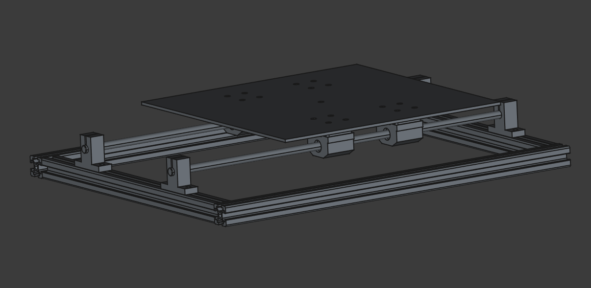
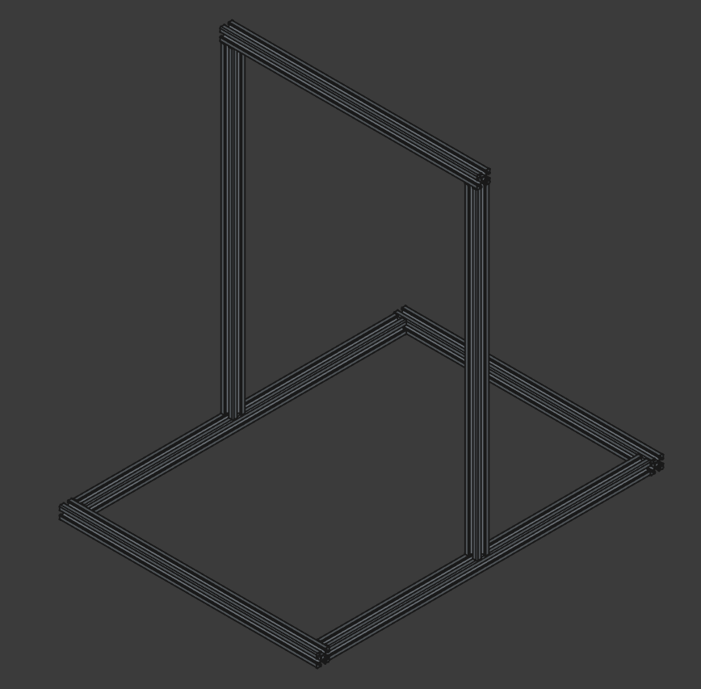

# PRINT ALL THE THINGS!

Current Y-Axis model

## A Quick Note

This repo will probably be pretty sparse for a while. Im still in the early stages of this project but I wanted to create a place to begin accumulating models, design documentation and parts research. Ill keep this readme updated as things develop.

## Design Considerations

My intention is to build a Cartesian printer similar to a Prusa i3 or Ender-3. Y motion will be applied to the print plate while the hot-end will move in the X and Z directions. It's my feeling that this will provide the most straightforward framework to develop a working printer which I can iterate and improve upon over time.

I am tentitively planning a print surface of 250 x 250 x 300 mm.

It's also worth noting that I do not currently own a 3d printer. This means my ability to fabricate custom parts is very limited. If absolutely necessary I can have a part printed at my local library or from an online printer but this will cause long lead times and very slow iteration. To that end I will be doing my best to only use commercially avialable parts. Once the printer is up and running I may opt to swap some of these parts out for printed ones if they will improve performance or streamline the design.

## Parts

My initial approach to part selection is to minimize cost wherever reasonable. At this point my goal is to build a functional printer without a strong focus on print speed or quality (yet). Through doing so I hope to develop my own skills and identify any knowledge gaps or incorrect assumptions I have.  

Once I have created a prototype device and rectified any design issues that become clear during that process I will begin iterating on the device and replacing those lower cost parts with higher end equipment where necessary to improve overall quality.  

Full Frame Model

## Modelling

The model will be broken into 3 primary sections, one for each axis. The Y-axis assembly will include the print plate while the X-axis will include the hotend and extruder. Each of these main assemblies will be further divided into sub assemblies to isolate different segments such as motor drives, frame segments, ect. 

All models will be created using FreeCAD 1.0. FreeCAD can be downloaded at the following link to access or modify the files:

https://www.freecad.org/

### Parts to be Modeled

#### General

- [x] Extrusions
- [x] Linear Bearing
- [x] Linear Rails
- [x] Motor
- [x] Motor Bracket
- [ ] Pulleys
- [x] Belt Clamps

#### Y-Axis

- [x] Print Surface Plate
- [x] Spacer/Crossbeams for plate (Currently being interfered with by rails end caps, needs tp be higher)

#### X-Axis

- [ ] Hot End
- [ ] Extruder
- [ ] Hot End and Extruder Brackets

#### Z-Axis

- [ ] Filament Holder
- [ ] XZ-Axis Connector Brackets

