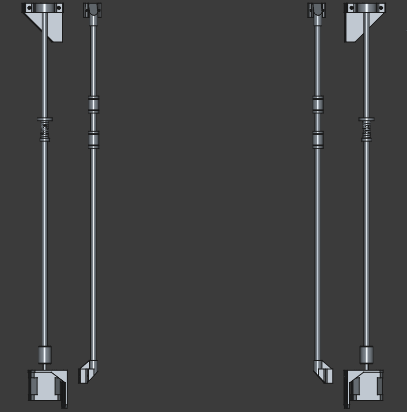

# PRINT ALL THE THINGS!

## A Quick Note

This project is still in the design phase and as yet remains unproven. 

## Design Considerations

My intention is to build a basic Cartesian printer. Y motion will be applied to the print plate while the hot-end will move in the X and Z directions. It's my feeling that this will provide the most straightforward framework to develop a working printer which I can iterate and improve upon over time.

- Print Area: ~300 x 300 x 300 mm 
- Total Size:  480 x 540 x 540 mm
- Frame Material: 2020 Aluminium Extrusion (T-Slot)

- 8mm Linear Rods and Bearings 
     - 2 per axis

- Actuation:
     - X and Y Axis: 6mm Belt
     - Z-Axis: Dual Lead Screws

- V_CPU: 5V
- V_IN : 24V

- Stepper Motors (Nema 17) Total: 5
     - Y-Axis: 1
     - X-Axis: 1
     - Z-Axis: 2
     - Extruder: 1

## Electrical

| Part               | Part Detail   | Number | Voltage      |Current       | Power          | Comment                             |
|--------------------|---------------|--------|--------------|--------------|----------------|-------------------------------------|
|Stepper             |Nema 17        | 5      |  24V         |1.7A          | 40.8W          |                                     |
|Motor Controllers   |TMC2209        | 4      |  24V         |7.5mA         | 180mW          | Z-Axis can share controller              |
|Hot End             |Anycubic Kobra2| 1      ||| 60W            | This is probably very temporary but will get me up and running, Power number is a rough estimate as hard numbers are limited  |
|Driver Board        |RAMPS1.4       | 1      |  24V         ||                | Interested in designing my own in future, will need modification to run at 24V|
|Main Board          |Arduino Mega   | 1      |  5V          ||                | Draw 5V off RAMPS board, cut power diode on RAMPS to avoid running 24V in|   
|Limit Switches      |Leaf Switches  | 3      |              ||                |                                     |
|Heated Bed          |?              | 1      |              ||                | Will leave off initial build and upgrade later |
|PSU                 |?              | 1      | 24V          ||                |                                     |
|Fans                |               | 1+     | 12-24V       ||                |                                     |  

## Modelling

The model will be broken into 3 primary sections, one for each axis. The Y-axis assembly will include the print plate while the X-axis will include the hotend and extruder. Each of these main assemblies will be further divided into sub assemblies to isolate different segments such as motor drives, frame segments, ect. 

All models will be created using FreeCAD 1.0. FreeCAD can be downloaded at the following link to access or modify the files:

https://www.freecad.org/

### Models

#### Full Frame

Needs Feet of some kind as the motors will drop beneath the frame by ~20mm. Could assist with leveling and shock absorbtion as well.

#### Y-Axis

#### X-Axis

#### Z-Axis

Still needs flanges and block to carry the x-axis

Needs a bracket to hold mounting bearings for lead screw

## Parts

My initial approach to part selection is to minimize cost wherever reasonable. At this point my goal is to build a functional printer without a strong focus on print speed or quality (yet). Through doing so I hope to develop my own skills and identify any knowledge gaps or incorrect assumptions I have.  

Once I have created a prototype device and rectified any design issues that become clear during that process I will begin iterating on the device and replacing those lower cost parts with higher end equipment where necessary to improve overall quality.

### Custom Parts

I've encountered a few places where the most cost effective, straightforward or easily available solution is to design a custom part. Unfortunately, I dont currently have access to a 3d printer. My hope is that I can  use woodblocks, zipties and prayers to hold the design together well enough to print rough copies of these parts and refine things from there. If that proves impossible I will reach out to a printing service or local makerspace to create these parts.

#### Offset Rod End Caps

#### Timing Idler Mount

Current model will be replaced with tensioning version, Screenshot to come

### Parts to be Modeled

#### General

#### X-Axis

- [ ] Hot End
- [ ] Extruder
- [ ] Hot End and Extruder Brackets
- [ ] Lead Screw Bearing Brackets
- [ ] Lead Screw Flange and Block

#### Z-Axis

- [ ] Filament Holder
- [ ] XZ-Axis Connector Brackets

