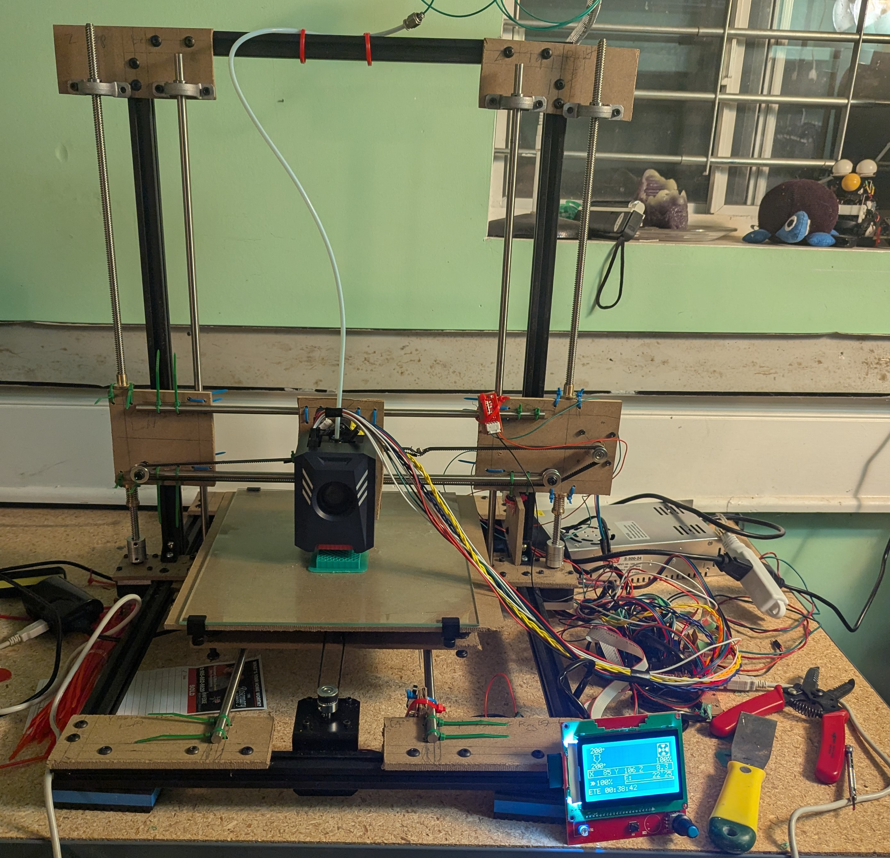

# MK0 - Basic Prototype

## Background

## Build Overview

## Configurations

## Lessons

### Bed Size and Verticle Rods

### Z-Endstop Relocation

### Bed Leveling Issues

### Wood Panelling is not Nice

### Hotend Sag

## Next Steps

### Replace The Panelling and Zip Ties

### Straighten Belt Runs and Add Tensioners

### Create Room for Full Sized Bed

### Create Better Bed Leveling System

### Remodel Print Head Carriage

### Increase Print Speeds