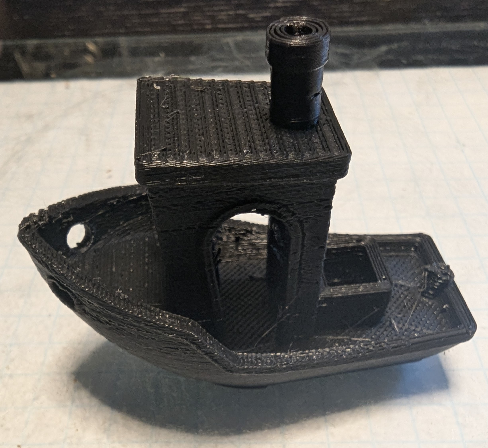
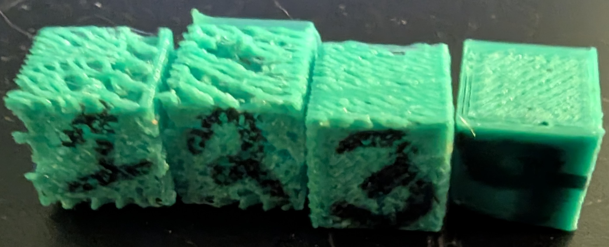
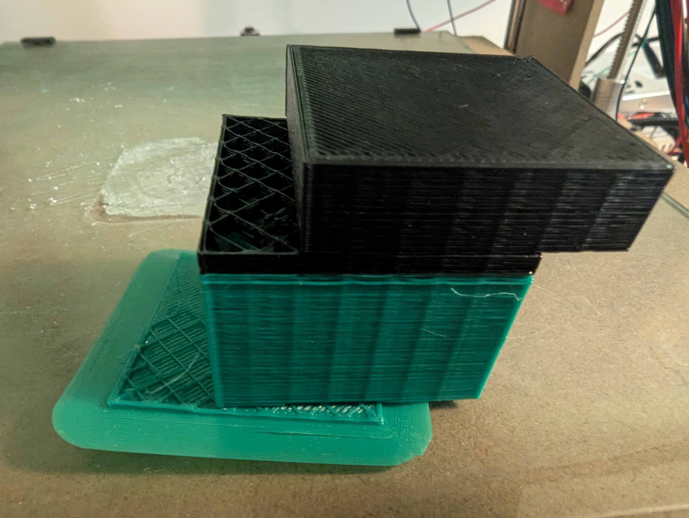
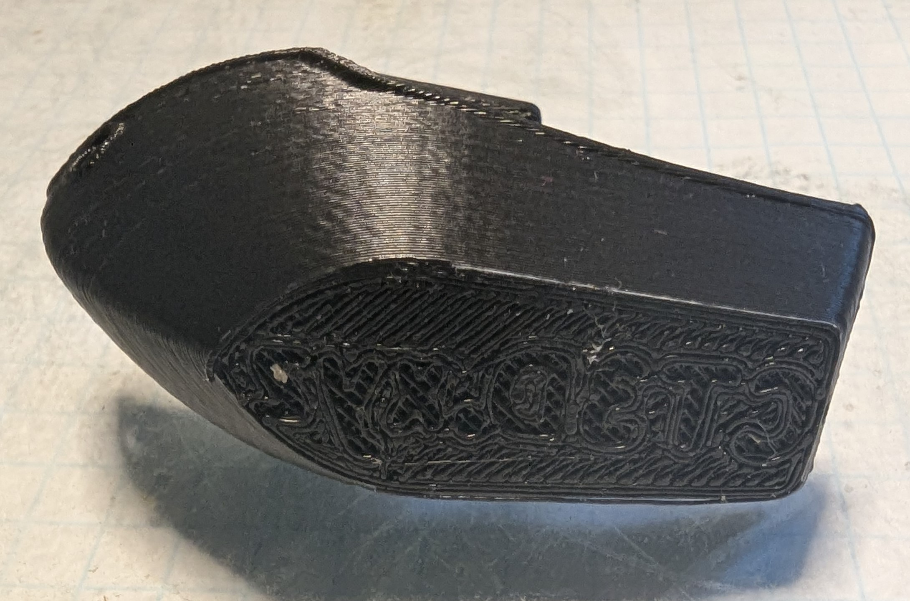
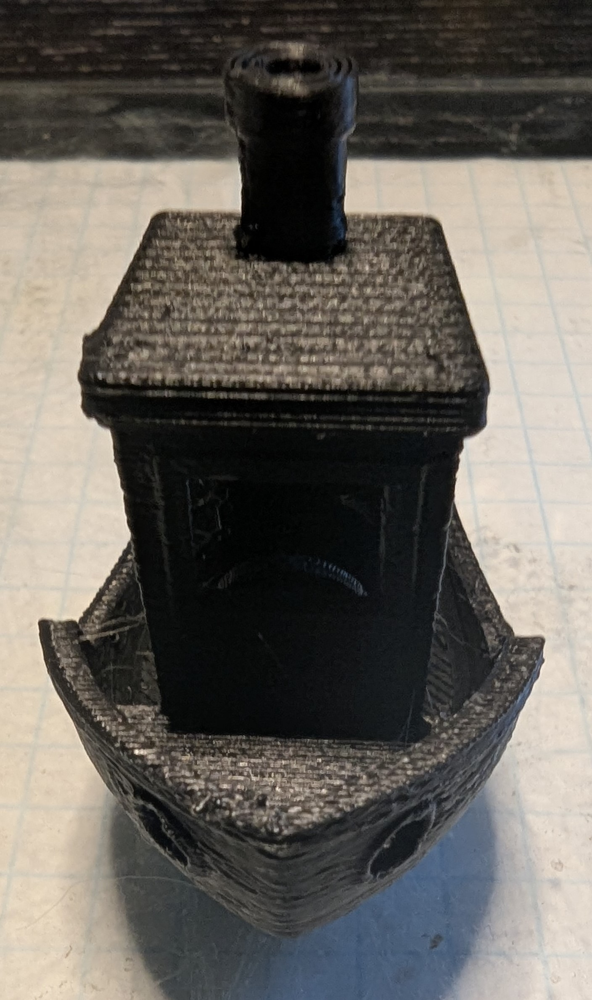
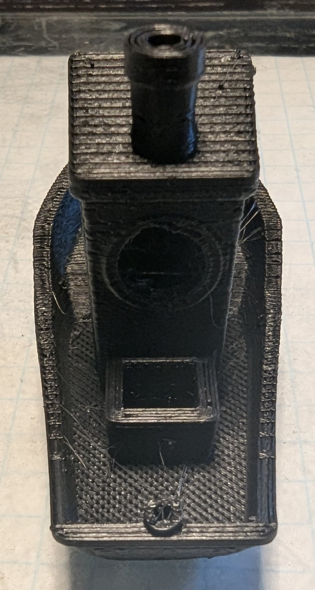

# MK0 Testing and Adjustments

## 10mm Cube Testing

Quick sanity checks with 10mm cubes, identified and fixed issues with underextrusion

## 40mm Cube

Attempting a larger build, Had Serious layer adhesion issues. This was caused by me setting the layer height to high.

View through the top shows how sparse top layer is. I didn't identify the root cause of this until after my first Benchy but it turns out my slicer had the filiment size set incorrectly.

## Benchy

Its a Benchy! This was while my filiment size was still incorrect which caused some issues. My results were greatly improved when I fixed that problem.

Still experiencing some extraction issues and artifacting.